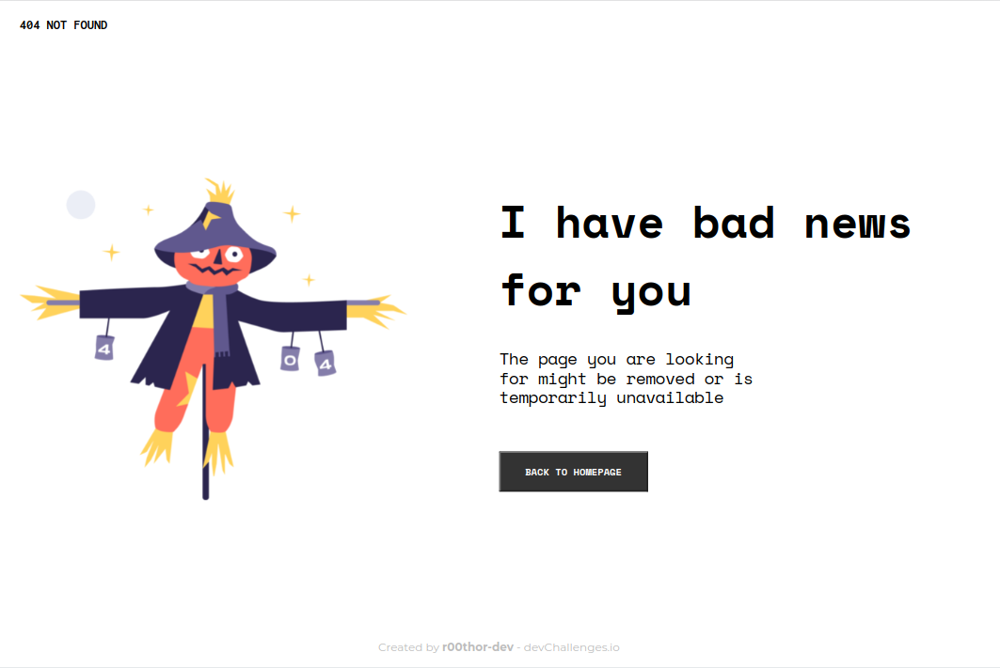

<!-- Please update value in the {}  -->

<h1 align="center">404 Not Found</h1>

   Solution for a challenge from  <a href="http://devchallenges.io" target="_blank">Devchallenges.io</a>.

  <h3>
    <a href="https://r00thor-dev.github.io/404-not-found-devchallenges/">
      Demo
    </a>
     | 
    <a href="https://github.com/r00thor-dev/404-not-found-devchallenges.git">
      Solution
    </a>
     | 
    <a href="https://devchallenges.io/challenges/wBunSb7FPrIepJZAg0sY">
      Challenge
    </a>
  </h3>

<!-- TABLE OF CONTENTS -->

## Table of Contents

- [Overview](#overview)
  - [Built With](#built-with)
- [Features](#features)
- [Contact](#contact)
- [Acknowledgements](#acknowledgements)

<!-- OVERVIEW -->

## Overview

### Built With

<!-- This section should list any major frameworks that you built your project using. Here are a few examples.-->

- [HTML](https://www.w3.org/html/)
- [CSS](https://www.w3.org/Style/CSS/Overview.en.html)
- [VIM](https://es.wikipedia.org/wiki/Vim)

## Features

<!-- List the features of your application or follow the template. Don't share the figma file here :) -->

This application/site was created as a submission to a [DevChallenges](https://devchallenges.io/challenges) challenge. The [challenge](https://devchallenges.io/challenges/wBunSb7FPrIepJZAg0sY) was to build an application to complete the given user stories.

## Acknowledgements

<!-- This section should list any articles or add-ons/plugins that helps you to complete the project. This is optional but it will help you in the future. For exmpale -->

- [A Complete Guide of Flexbox](https://css-tricks.com/snippets/css/a-guide-to-flexbox/)
- [A Complete Guide to Grid](https://css-tricks.com/snippets/css/complete-guide-grid/)

## Contact

- GitHub [@r00thor-dev](https://github.com/r00thor-dev/)
